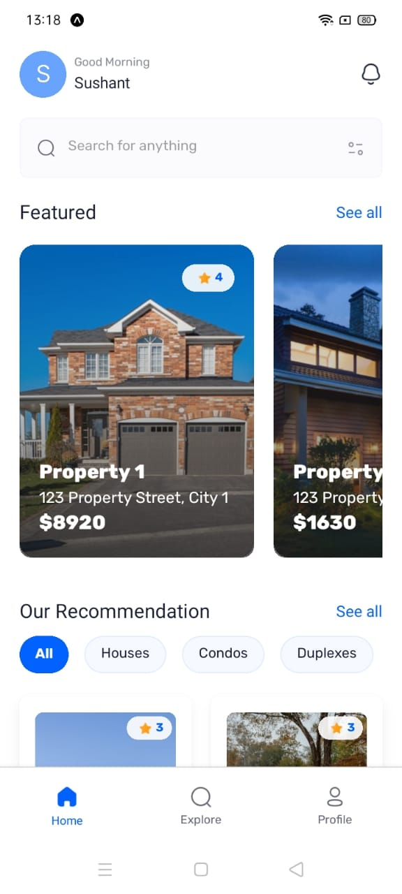
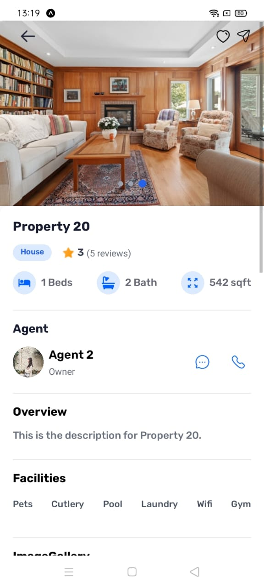
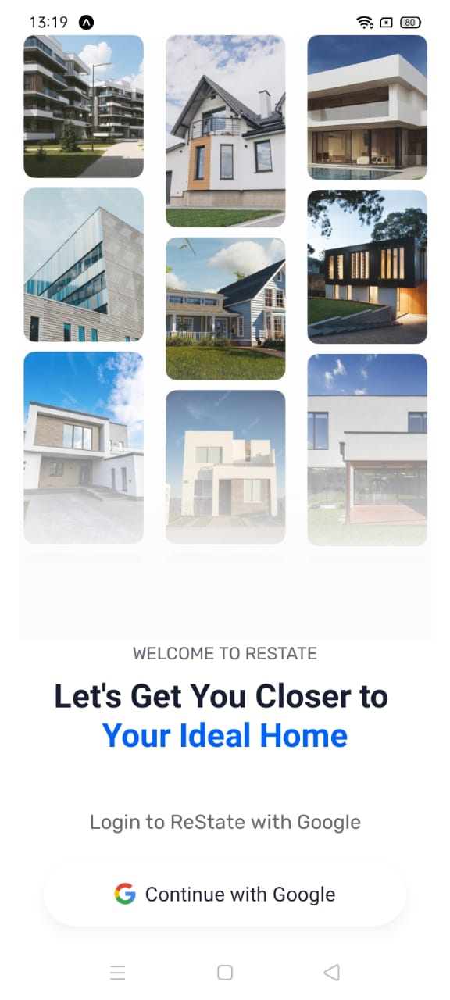

# My First React Native App

Welcome to my first React Native app! 🎉

This app is built using React Native, which allows you to build mobile applications using JavaScript and React. It features a modern mobile UI and utilizes a variety of React Native components and libraries to provide a smooth and responsive experience.

---

## Features ✨

- **Responsive Design:** The app is designed to be responsive and work across multiple device sizes.
- **Interactive UI:** Includes interactive features like buttons, navigation, and more.
- **User Authentication:** Allows users to log in and access personalized content (if implemented).
- **API Integration:** Fetches data from external APIs to display information dynamically.

---

## Screenshots 📸

Here are some screenshots of the app in action:

### Home Screen


### Details Screen


### Login Screen


---

## Getting Started 🚀

To get this app up and running on your local machine, follow these steps:

1. **Clone the repository:**
    ```bash
    git clone https://github.com/yourusername/my-first-react-native-app.git
    ```
2. **Install dependencies:**
    ```bash
    cd my-first-react-native-app
    npm install
    ```

3. **Run the app:**
    For iOS:
    ```bash
    npx react-native run-ios
    ```

    For Android:
    ```bash
    npx react-native run-android
    ```

---

## Libraries Used 📦

- **React Navigation**: For routing and navigation within the app.
- **Axios**: For API requests.
- **React Native Elements**: For UI components.
- **React Native Vector Icons**: For adding custom icons.

---

## Acknowledgements 🙏

- Thanks to [React Native](https://reactnative.dev/) for making mobile app development fun and efficient!
- Big shoutout to all the contributors of React Native tutorials and libraries that helped me along the way.

---

## License 📝

This project is licensed under the MIT License - see the [LICENSE.md](LICENSE.md) file for details.

---

### How to add images to the markdown:

To add images to the markdown, you need to place your images in a folder, such as `/images/`. The images should be stored locally in your project directory (or hosted online if you're linking to them remotely). Here’s an example structure:

